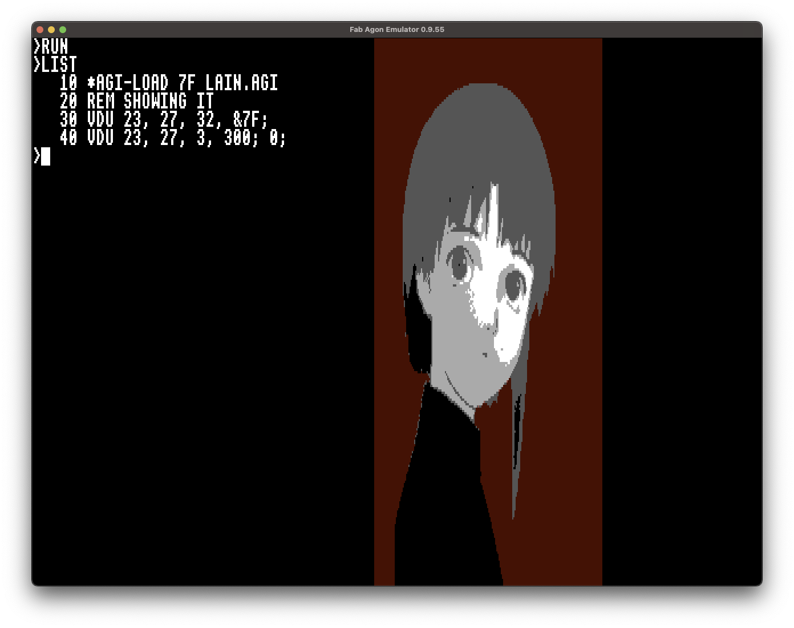

# Simple graphics format for Agon computers

This format tries reduce file sizes and make it easy to use/load from any source(network, sd card etc).

## Image format

It's simple wrapper for RGB2222 that simplifies loading it from any media and showing it on screen. Data is little endian. 

File starts with two bytes header `IM`(like IMage). 

Next goes this two bytes(word) - size of raw data(bitmap).

After width of image(word) and height(also word).

Next goes status byte - format of stored bitmap:
 * `0` - bitmap stored without RLE compression. After this byte RGB2222 bitmap stored as is.

 * `1` - bitmap stored with RLE compression. Next goes:
  
   - Word that counts how many RLE frames are stored

   - RLE frames that built from: first byte - repeats count; second byte - byte that will be repeated

Format can be extended in future but also it built for making usage simple from any source - RAM, disk etc

## Image converter

It uses Python 3 with PIL library.

It can convert PNG, Jpeg and whatever PIL supports - just call it:

```
./img2agonimg.py botan.jpg botan.agi
```

And if image fits to buffer of VDP you'll got resulting file

## Loader(works with buffered bitmaps)



Put `agi-load.bin` to `/mos/` directory and you'll have possibility load images directly to VDP from SD card(to specified buffer number). Utility supports loading up to 255 images.

Example usage is:
```
agi-load 7F example-image.agi
```

Image will be loaded to buffer 127(buffer number should be specified in HEX). 

And after loading images you can draw them using usual VDP sequences for Buffered API for Images:

```basic
10 REM Loading images
20 *AGI-LOAD 7F LAIN.AGI
30 *AGI-LOAD 02 BOTAN.AGI
40 VDU 22 3
50 REM SELECTING Image
60 VDU 23, 27, 32, &7F; 
70 REM Drawing it
80 VDU 23, 27, 3, 100; 100;
```

## Example of loading file

Example of usage included as `agi-view` mos application(you can put it to `/bin` directory and use as command).

You can specify file name to it - and it will shows you image.

Some test images are included in `test/` directory.